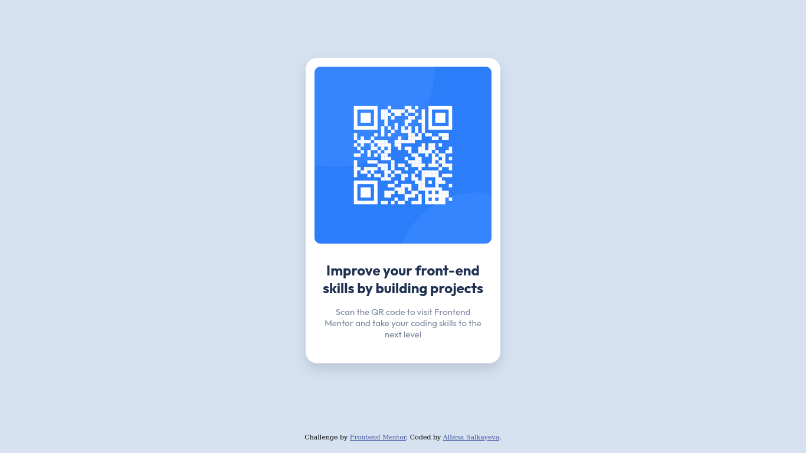

# Frontend Mentor - QR code component solution

This is a solution to the [QR code component challenge on Frontend Mentor](https://www.frontendmentor.io/challenges/qr-code-component-iux_sIO_H). Frontend Mentor challenges help you improve your coding skills by building realistic projects. 

## Table of contents

- [Overview](#overview)
  - [Screenshot](#screenshot)
  - [Links](#links)
- [My process](#my-process)
  - [Built with](#built-with)
  - [What I learned](#what-i-learned)
  - [Useful resources](#useful-resources)
- [Author](#author)

## Overview

### Screenshots

|Desktop|Mobile|
|:-:|:-:|
|||

### Links

- Solution URL: [github.com/albina0104/qr-code-component](https://github.com/albina0104/qr-code-component)
- Live Site URL: [albina0104.github.io/qr-code-component/](https://albina0104.github.io/qr-code-component/)

## My process

### Built with

- HTML5
- CSS Flexbox

### What I learned

When trying to center a div both vertically and horisontally with absolute positioning, or with flexbox properties `justify-content: center` and `align-items: center` - there is an issue on small screens in landscape mode. When overflow happens - the top part of the div is hidden and cannot be seen, we can scroll down, but not up to the top of the div. Moreover, with absolute positioning elements can overlap each other on small screens.

To prevent this issue, I used flexbox and the property `margin: auto` to center the flex item.

Note: the centered flex item is not exactly in the center because there is a second flex item with a row of text.

### Useful resources

- [Centring flex items and allowing overflow scroll](https://bhch.github.io/posts/2021/04/centring-flex-items-and-allowing-overflow-scroll/) - This is a good post about centering flex items.
- [Center one flex item and bottom-align another](https://stackoverflow.com/a/39359983) - This is a StackOverflow answer where I found the solution to the issue described above, as I wanted main element to be centered, and the row of text to be at the bottom of the page, without possibility of overlapping elements or hiding element parts on small screens.

## Author

- Frontend Mentor - [@albina0104](https://www.frontendmentor.io/profile/albina0104)
- GitHub - [albina0104](https://github.com/albina0104)
